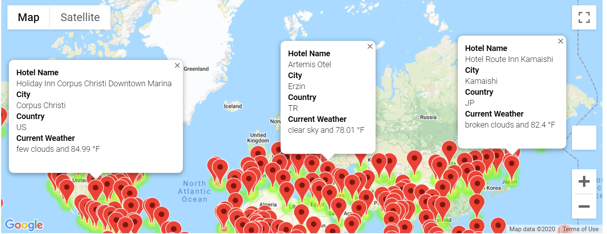
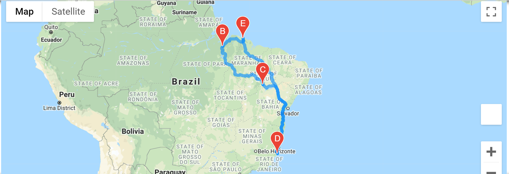
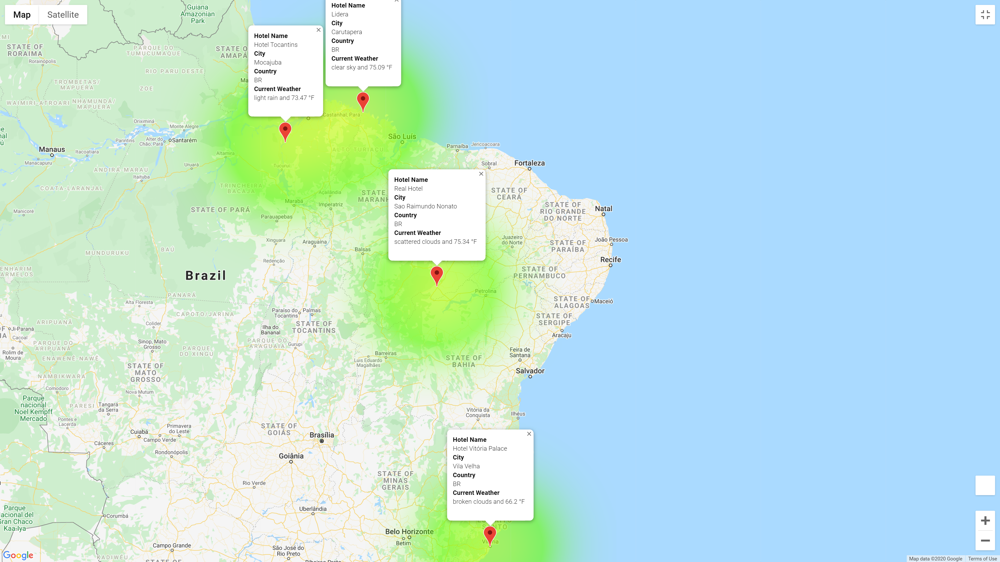

# World_Weather_Analysis
World weather analysis is all about using APIs to get weather data for cities all around the world and then creating a travel itinerary for 4 chosen cities using Google's gmap API. 

## Resources
1. citypy API
2. openweathermap API
3. Google's 'places' API
4. Google's 'directions' API
5. Json Request and Response parsing

## Getting weather data
In [Weather_Database.ipynb](Weather_Database/Weather_Database.ipynb) file, I start with generating 2000 random numbers to get latitudes and longitudes around the globe. 

    # Create a set of random latitudes and longitudes combinations
    lats = np.random.uniform(low=-90.000,high=90.000,size=2000)
    lngs = np.random.uniform(low=-180.000,high=180.000,size=2000)
    lat_lngs = zip(lats, lngs)
    lat_lngs
   
    # Add the latitudes and longitudes to a list.
    coordinates = list(lat_lngs)
Then using the **'citipy'** API, got the list of cities for the 2000 latitude-longtitude combinations.

And finally, using the **OpenWeatherMap** API and JSON parsing, got the weather data like Maximum Temperature, Humidity, Cloudiness, Wind Speed and Current Weather conditions for each city in the list.

    url = "http://api.openweathermap.org/data/2.5/weather?units=imperial&APPID=" + weather_api_key

    try:
        # Parse the JSON and retrieve data.
        city_weather = requests.get(city_url).json()
        # Parse out the needed data.
        city_lat = city_weather["coord"]["lat"]
        city_lng = city_weather["coord"]["lon"]
        city_max_temp = city_weather["main"]["temp_max"]
        city_humidity = city_weather["main"]["humidity"]
        city_clouds = city_weather["clouds"]["all"]
        city_wind = city_weather["wind"]["speed"]
        city_country = city_weather["sys"]["country"]
        city_weather_description = city_weather["weather"][0]["description"]
        # Append the city information into city_data list.
        city_data.append({"City": city.title(),
                          "Lat": city_lat,
                          "Lng": city_lng,
                          "Max Temp": city_max_temp,
                          "Humidity": city_humidity,
                          "Cloudiness": city_clouds,
                          "Wind Speed": city_wind,
                          "Country": city_country,
                          "Current Description":city_weather_description})

        # If an error is experienced, skip the city.
        except:
            print("City not found. Skipping...")
            pass

All of this information is then written to [WeatherPy_Database.csv](Weather_Database/WeatherPy_Database.csv) file.

## Get Nearby Hotels Info on the cities
Working off of the WeatherPy data, in [Vacation_Search](Vacation_Search/Vacation_Search.ipynb) file, user is asked to input maximum and minimum temperature where she would like to visit. 

Based on the input a subset of data is retrieved matching the maximum and minimum temparature criteria. Any rows with null value is cleared from the final data set.

Then, using Google's places API and JSON parsing, the nearest hotel in the cities within 5000 meters radius is obtained. If no hotel is found within 5000 meters radius, the city is not included in the dataset.

    #Set parameters to search for hotels with 5000 meters.
    params = {
        "radius": 5000,
        "type": "lodging",
        "key": g_key
    }

    # Iterate through the hotel DataFrame.
    for index, row in hotel_df.iterrows():
        # Get latitude and longitude from DataFrame
        lat = row["Lat"]
        lng = row["Lng"]
    
        # Set up the base URL for the Google Directions API to get JSON data.
        params["location"] = f"{lat},{lng}"
        base_url = "https://maps.googleapis.com/maps/api/place/nearbysearch/json"

        # Make request and retrieve the JSON data from the search. 
        hotels = requests.get(base_url, params=params).json()
    
        # Get the first hotel from the results and store the name, if a hotel isn't found skip the city.
        try:
            hotel_df.loc[index, "Hotel Name"] = hotels["results"][0]["name"]
        except (IndexError):
            print("Hotel not found...skipping the city")

Hotel information along with other information for each city is then saved to [WeatherPy_vacation.csv](Vacation_Search/WeatherPy_vacation.csv) file.

Google map markers are added to each hotel record with details showing Hotel Name, City, Country, Current Weather Conditions and Maximum Temperature of the city. 

Here is the example of the Google Map Markers:

## Create Itinerary for the User
Next step was to create a itinerary for the user within 1 country. Since we needed 4 cities to create a round trip itinerary, the list of cities were further trimmed down to only those countries that had 4 or more cities. To achieve this, dataset manipulations had to be done using **groupby()** function.

    # Group by Country and get the count on the City column
    city_count_df = vacation_df.groupby("Country").count()["City"]
    # create a new dataset by merging the groupby country dataset and the original dataset 
    new_vacation_df = pd.merge(vacation_df,city_count_df,on=["Country","Country"])
    # Get a new data of only those records that have City count od 4 or more.
    trimmed_vacation_df = new_vacation_df.loc[new_vacation_df["City_y"] >= 4]

The final dataset **trimmed_vacation_df** now contains only those cities that are in country with 4 or more cities.

User is then given an option to select a country where she would like to travel.

    unique_countries = list(trimmed_vacation_df["Country"].unique())
    country_list = ""
    print("From the list below select one Country you want to travel:")
    for country in unique_countries:
        country_list += (f"{country}, ")
    print(country_list)    
    chosen_country = input("Make Selection:")

The output looks like this, when the user has made her selection:

    From the list below select one Country you want to travel:
    PF, US, ID, MU, MX, NC, BR, CN, IN, AU, CD, PT, CV, CA, CI, GH, MG, 
    Make Selection:BR

Based on the selected country, a new dataset is created with cities in the chosen country.
    
    cities_in_chosen_country_df = vacation_df.loc[vacation_df["Country"]==chosen_country]   

Four cities are then randomly selected to create the itinerary:

    vacation_cities = cities_in_chosen_country_df.sample(n=4)

Using these 4 cities and Google's **Directions** API, the itinerary is created for *Driving* mode.

    fig = gmaps.figure()
    roundtrip = gmaps.directions_layer(start,end,waypoints=[stop1,stop2,stop3],travel_mode='DRIVING')
    fig.add_layer(roundtrip)
    fig

The generated map looks like this:

To add more details for the user, Google markers are added to display Hotel Name, City and Country Name and Current Weather conditions for the 4 cities in the itinerary.

**Bon Voyage to our user driving through cities in Brazil.**